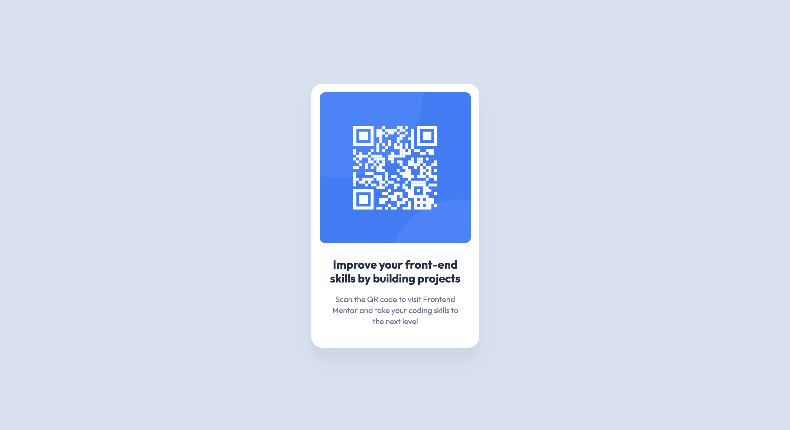

# Frontend Mentor - QR code component solution

This is a solution to the [QR code component challenge on Frontend Mentor](https://www.frontendmentor.io/challenges/qr-code-component-iux_sIO_H). Frontend Mentor challenges help you improve your coding skills by building realistic projects. 

## Table of contents

- [Overview](#overview)
  - [Screenshot](#screenshot)
  - [Links](#links)
- [My process](#my-process)
  - [Built with](#built-with)
  - [What I learned](#what-i-learned)
  - [Continued development](#continued-development)
  - [Useful resources](#useful-resources)
- [Author](#author)
- [Acknowledgments](#acknowledgments)

## Overview

### Screenshot

### Links

- Solution URL: [https://github.com/zenkarsha/qr-code-component](https://github.com/zenkarsha/qr-code-component)
- Live Site URL: [https://zenkarsha.github.io/qr-code-component/](https://zenkarsha.github.io/qr-code-component/)

## My process

### Built with

- Flexbox

### What I learned

How to get box-shadow in figma design mode.

### Continued development

### Useful resources

- [Google](https://www.google.com) - This helped me to finish this challenge more quickly.
- [Figma drop and inner shadow to CSS box shadow](https://www.figma.com/community/plugin/1374511779922909714/figma-drop-and-inner-shadow-to-css-box-shadow) - Figma drop and inner shadow to CSS box shadow: convert figma shadow to css box-shadow

## Author

- Website - [zenkarsha](https://zenkarsha.github.io/)
- Frontend Mentor - [@zenkarsha](https://www.frontendmentor.io/profile/zenkarsha)

## Acknowledgments
